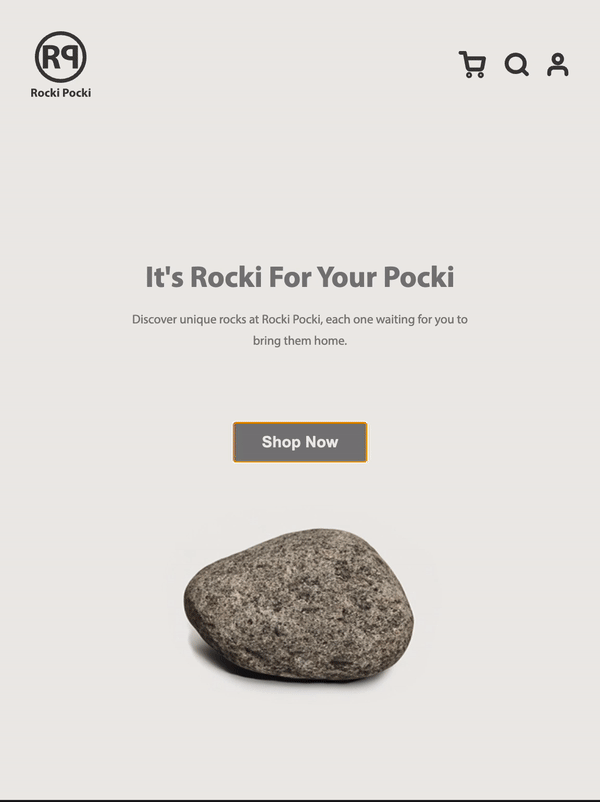
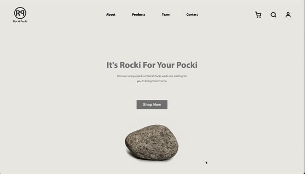

# RockiPocki

Welcome to the Rocki Pocki! This is a mock business website designed to showcase and sell high-quality rocks. The website is fully responsive, meaning it adapts and provides an optimal viewing experience across various screen sizes, from mobile devices to desktop computers. The layout and styling have been implemented using flexbox, and clickable navigation has been created using anchors.

## Technologies Used

HTML: The structure and content of the website.
CSS: The styles and layout of the website, including the use of flexbox.

The design for this site was created in Figma. [View the Figma design here](https://www.figma.com/file/0Cyjk7cEczMwV67BqLWaP1/Rocki-Pocki-Mocki?type=design&node-id=1%3A2&mode=design&t=DWWKL9522AmeooKz-1)

## Getting Started

To view the website locally on your machine, follow these steps:

Clone the repository or download the source code.
Open the index.html file in a web browser.

## Contributing

This is a mock business website created as a personal project to learn and practice HTML and CSS, and contributions are not actively sought. However, if you have any suggestions, feedback, or bug reports, feel free to open an issue in the repository or email Pensive Pasta: pensivepasta@gmail.com.

## Demonstration of responsive breakpoints

